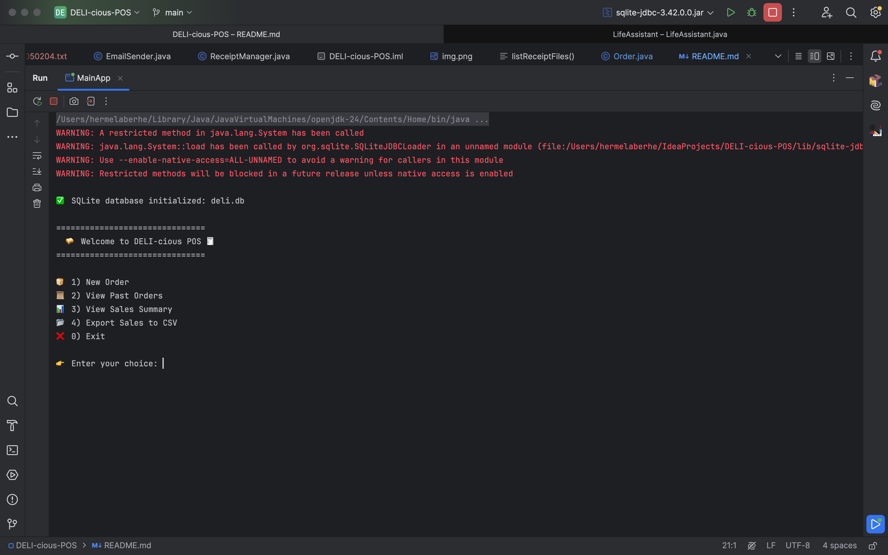
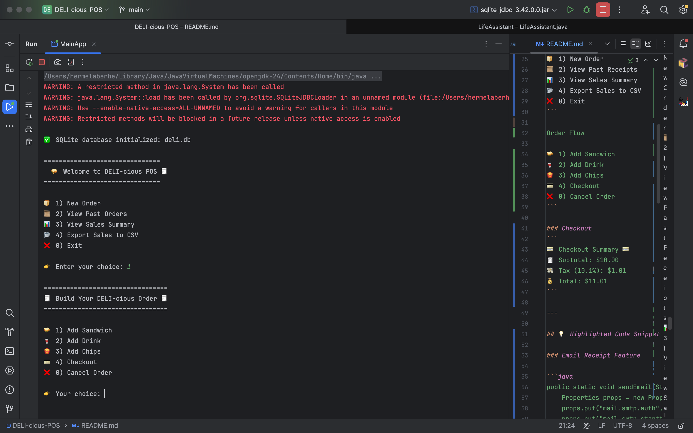
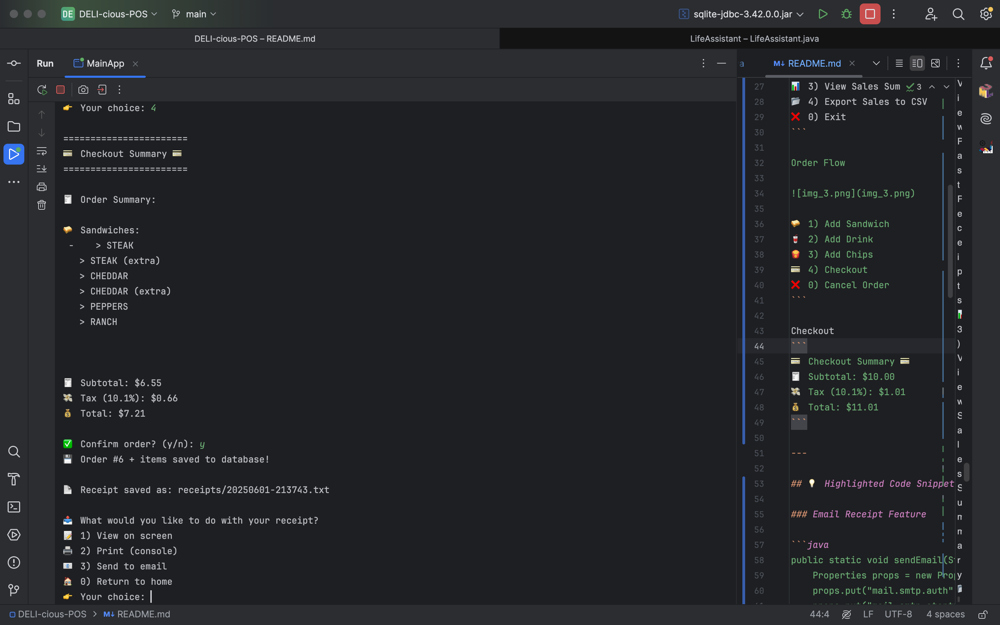
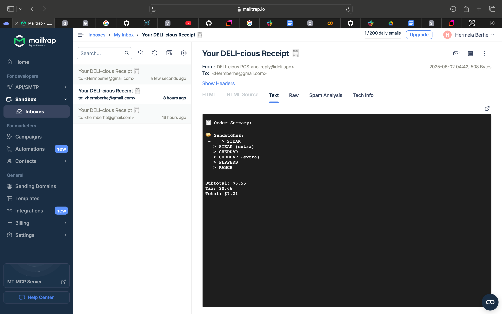
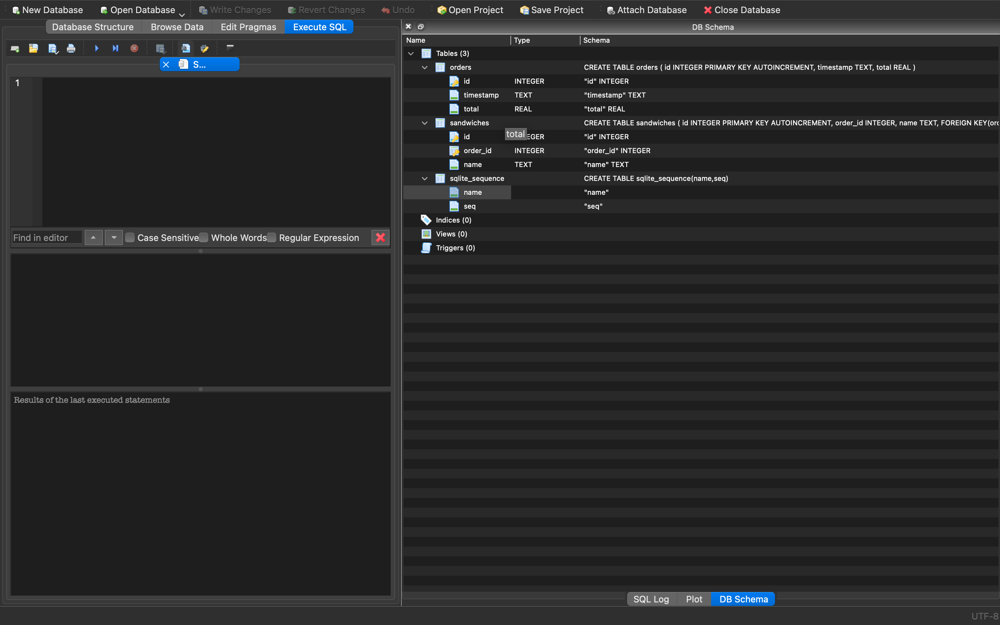
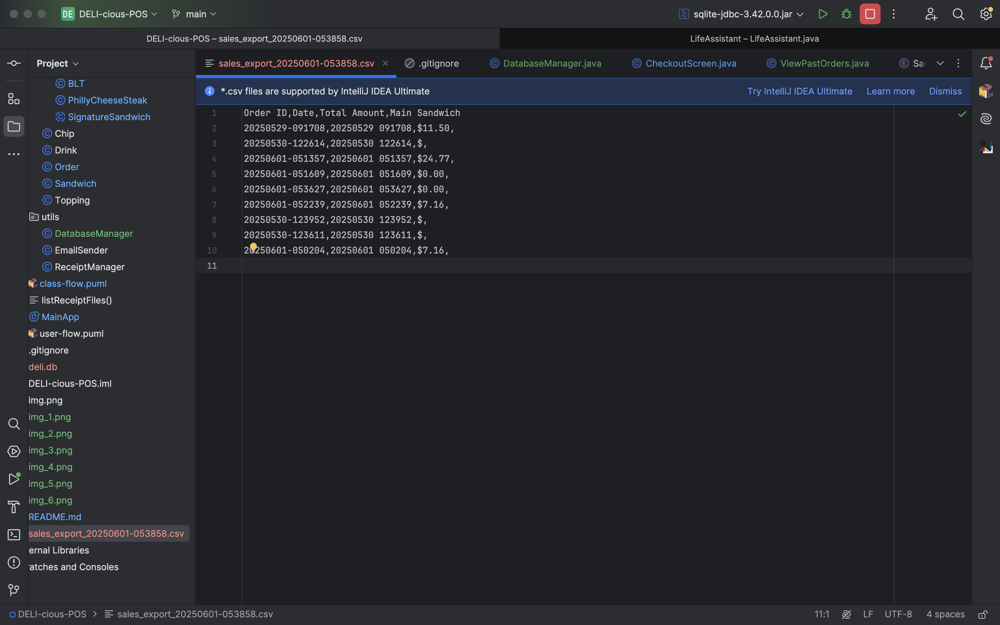
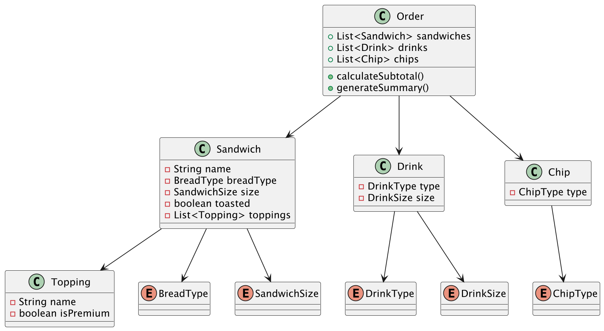
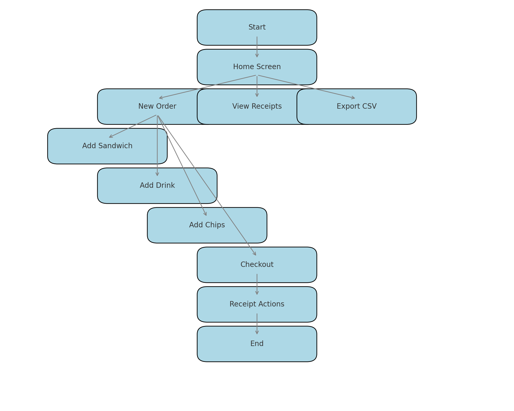

# 🥪 DELI-cious POS

**DELI-cious POS** is a full-featured Java-based point-of-sale terminal app for sandwich shops. With a sleek, emoji-rich interface, users can build and customize orders in a way that mirrors real-life deli experiences. 💳

 Project Overview

This application simulates a sandwich shop POS system. Customers can:
- Build custom or signature sandwiches
- Add drinks and chips with calorie and nutrition facts
- Checkout with tax calculation
- View, print, and email receipts
- Store and manage orders in an SQLite database
- Export receipts and sales to CSV
- Access future owner/admin views (WIP)


🎥 App Screens (Console Output)

Home Screen


🥪 Welcome to DELI-cious POS 🧾

🍞 1) New Order
📜 2) View Past Receipts
📊 3) View Sales Summary
📂 4) Export Sales to CSV
❌ 0) Exit

 
Order Flow




🥪 1) Add Sandwich
🥤 2) Add Drink
🍟 3) Add Chips
💳 4) Checkout
❌ 0) Cancel Order


Checkout

```
💳 Checkout Summary 💳
🧾 Subtotal: $10.00
💸 Tax (10.1%): $1.01
💰 Total: $11.01
```

---


A method under Utils/EmailManager- sends a receipt via email using the Mailtrap sandbox inbox. It connects using SMTP and dynamically formats the receipt content.




csv file 


 📊 UML & ER Diagrams created using PlantUML

### UML Class and User flow Diagram (Simplified)



- **Order**
    - List<Sandwich>
    - List<Drink>
    - List<Chip>
- **Sandwich**
    - BreadType
    - Size
    - List<Topping>
- **Topping**
    - String name
    - boolean isPremium

### ER Diagram


- **Orders** (id, timestamp, total)
- **Items** (order_id, item_name, type, size, calories, price)


🔧 Technologies Used

- Java 17+
- SQLite (JDBC)-link -https://www.mathworks.com/help/database/ug/sqlite-jdbc-for-macos.html
- Jakarta Mail + Mailtrap -Link - https://mailtrap.io/inboxes/3755020/messages/4910564881
- IntelliJ IDEA


 Setup Guide

1. Place all `.jar` files in `/lib`:
    - `sqlite-jdbc`
    - `jakarta.mail`
    - `jakarta.activation`

2. Add them in IntelliJ:
    - File > Project Structure > Modules > Dependencies > + JAR

3. Run the `MainApp.java` file.

4. Use `deli.db` with a SQLite browser to inspect or manage records.


📦 Interesting  Features 

- Signature sandwiches (BLT, Cheesesteak)
- Nutrition display (cal, protein, carbs)
- Email receipts via Mailtrap
- Database persistence
- Dynamic tax
- Admin view (coming next!)

