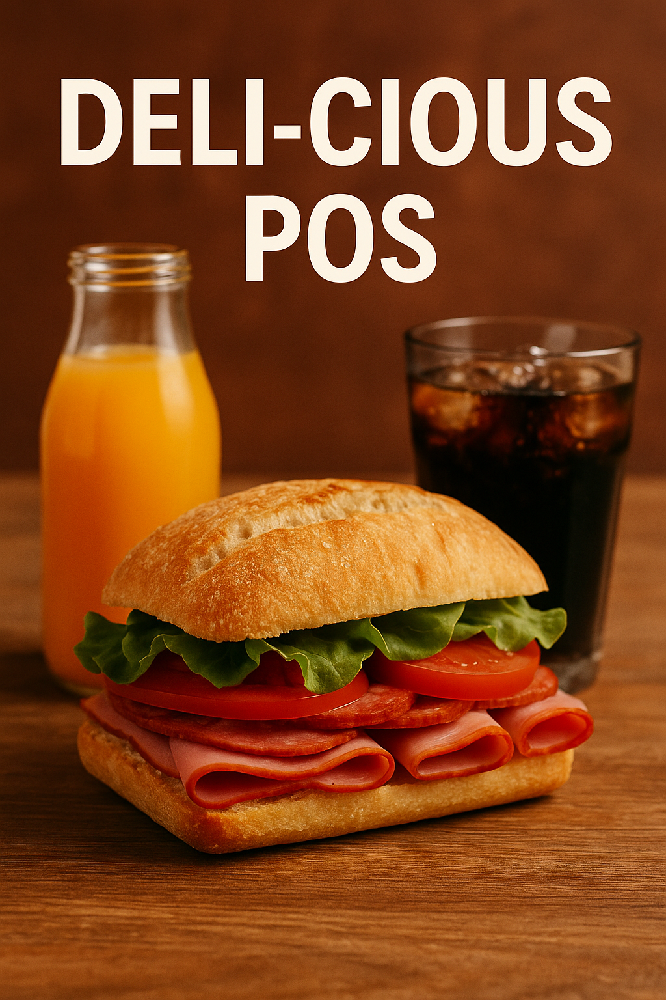

# 🥪 DELI-cious POS

[image](https://github.com/user-attachments/assets/e35fabef-925a-4428-9230-34840fdbb027)

A Java-based Point-of-Sale system for sandwich shops — designed for quick ordering, flexible customization, receipt generation, and CSV exporting.

---

## 🚀 Features

- 🔧 Custom sandwich builder (bread, size, toasted, toppings)
- ⭐ Signature sandwich presets (BLT, Philly)
- 🥤 Add drinks with sizes & flavors
- 🍟 Add chips with flavor
- 💵 Checkout with payment method selection
- 🧾 Save receipts to `/receipts`
- 📂 View past orders anytime
- 📊 Export orders to `orders.csv` for analysis

---

## 📁 Folder Structure

DELI-cious-POS/
├── src/
│ ├── models/
│ │ ├── Sandwich.java, Drink.java, Chip.java, etc.
│ ├── enums/
│ │ ├── BreadType.java, ToppingType.java, etc.
│ └── services/
│ └── OrderManager.java
├── receipts/
│ └── [auto-saved receipts]
├── orders.csv
├── README.md

Class diagram  -using PlantUML

Flow chart-using PlantUML

📦 Data Handling

The DELI-cious POS system replaces the traditional paper-based process with a robust, database-backed solution using SQLite and JDBC.

✅ Inventory Management
Inventory items (breads, toppings, drinks, chips) are stored in the SQLite database under the Inventory table (optional extension if tracking stock).
The application dynamically loads inventory data from the database at runtime, ensuring accurate and up-to-date item listings.

✅ Order Transactions
When a customer places and confirms an order, it is:
Saved as a transaction in the Transactions table.
All ordered items (sandwiches, drinks, chips) are stored in the associated OrderItems table using a foreign key to the transaction ID.
This allows full order reconstruction, analytics, and admin reporting.

✅ CSV & Text Receipt Output
Each completed order generates:
A printable text receipt saved in the receipts/ folder.
A recorded entry in the database for future reference.
Admins can export all orders to CSV with a single click, enabling simple financial reporting and analysis.

✅ Tools & Libraries
SQLite (Embedded DB)
JDBC for SQL database interaction

